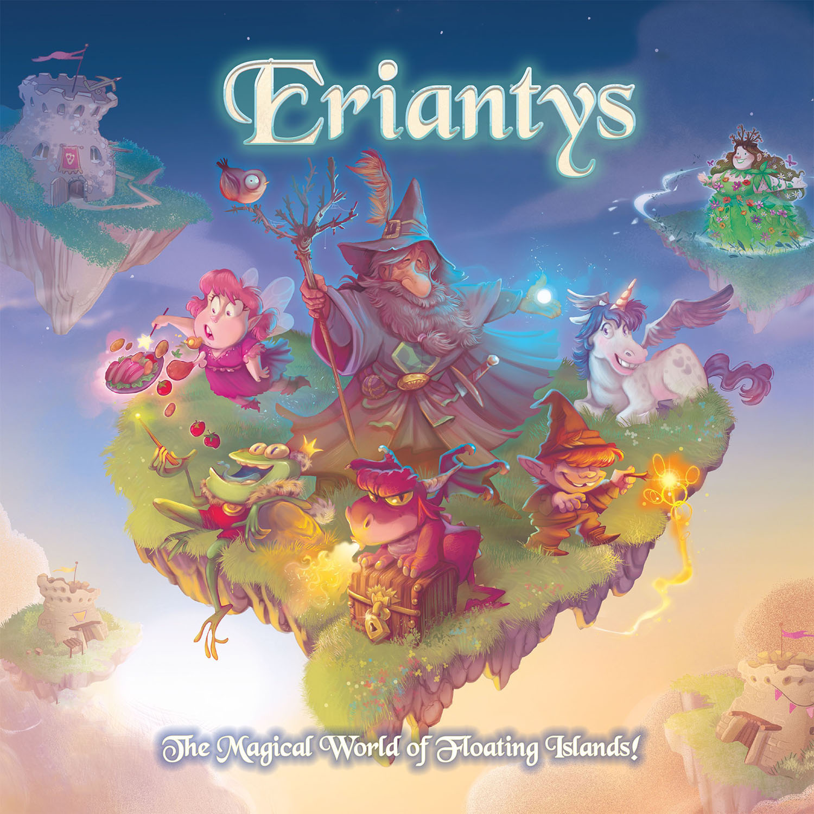

# Eriantys - Software Engineering Project



Eriantys is the final test of **"Software Engineering"**, course of **"Computer Science Engineering"** 
held at Politecnico di Milano (2021/2022). <br />

**Professor**: Gianpaolo Cugola

**Group**: GC-45

**Students**: 
- Andrea Piras (ID Number: 936909)
- Andrea Sanguineti (ID Number: 936930)
- Emanuele Santoro (ID Number: 933198)

## Project info
The project consists of a Java version of the board game *Eriantys*.

The project includes:
- High level uml diagram;
- Complete uml diagram;
- Peer Reviews of model and network of group GC-55;
- Source code of the game implementation;
- Source code of junit tests;
- Compiled JAR file.

## Implemented Functionalities

| Functionality           | Status             |
|-------------------------|--------------------|
| Basic Rules             | :heavy_check_mark: |
| Complete Rules          | :heavy_check_mark: |
| CLI                     | :heavy_check_mark: |
| GUI                     | :heavy_check_mark: |
| Socket                  | :heavy_check_mark: |
| Character Cards (FA 1)  | :heavy_check_mark: |
| 4 Players Match (FA 2)  | :heavy_check_mark: |
| Multiple Matches (FA 3) | :heavy_check_mark: |

## Testing

Almost all `model` and `controller` classes have a class and method coverage of 100%.

**Coverage**: code lines covered.

| Package    | Class          | Coverage      |
|------------|----------------|---------------|
| Model      | Entire Package | 94% (720/763) |
| Controller | Entire Package | 82% (250/303) |
| Controller | ClientHandler  | 69% (53/76)   |
| Controller | Controller     | 90% (166/184) |
| Controller | Server         | 72% (31/43)   | 


## Compile

To run the test and compile the software:

1. Install [Java SE Development Kit 18](https://docs.oracle.com/en/java/javase/18/)
2. Install [Maven](https://maven.apache.org/install.html)
3. Clone this repo by either downloading the `.zip` and extract it, or using the `git clone` command.
4. Open a terminal, navigate to the project folder and compile sources of the package:
    ```bash
    cd /path/to/project/home/directory
    mvn clean package
    ```

## Run using the JAR file
Once installed all requirements and compiled the project, open a terminal and
go to the project target directory. 
Once there it is possible to choose to run the server or the client (CLI or GUI):

### Run the Server
```bash
java -jar Eriantys.jar -s 
```
or
```bash
java -jar Eriantys.jar --server 
```
### Run the Client (CLI)
```bash
java -jar Eriantys.jar -c 
```
or
```bash
java -jar Eriantys-jar-with-dependencies --cli 
```

### Run the Client (GUI)
```bash
java -jar Eriantys.jar 
```
To run the Client (GUI) it is also possible to open the JAR file directly from
the file explorer.

### Recommendations

In order to play, you'll have to launch at least one server and two clients (either CLI or GUI).

**WARNING**: For the best GUI experience it is strongly suggested to play with a screen resolution
of 1920x1080 (100% DPI) and with a scaling of 100%.

**WARNING**: For the best CLI experience it is strongly suggested to play with the terminal in fullscreen mode. 
Based on the system setting, zooming out/in the terminal could improve the appearance of the game.


